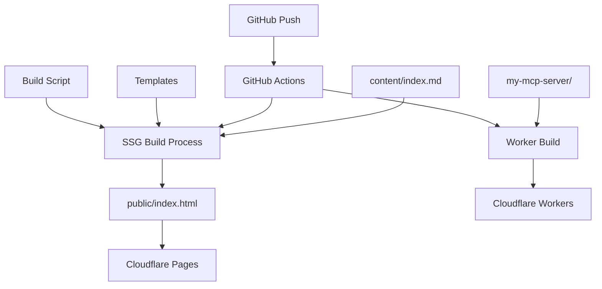
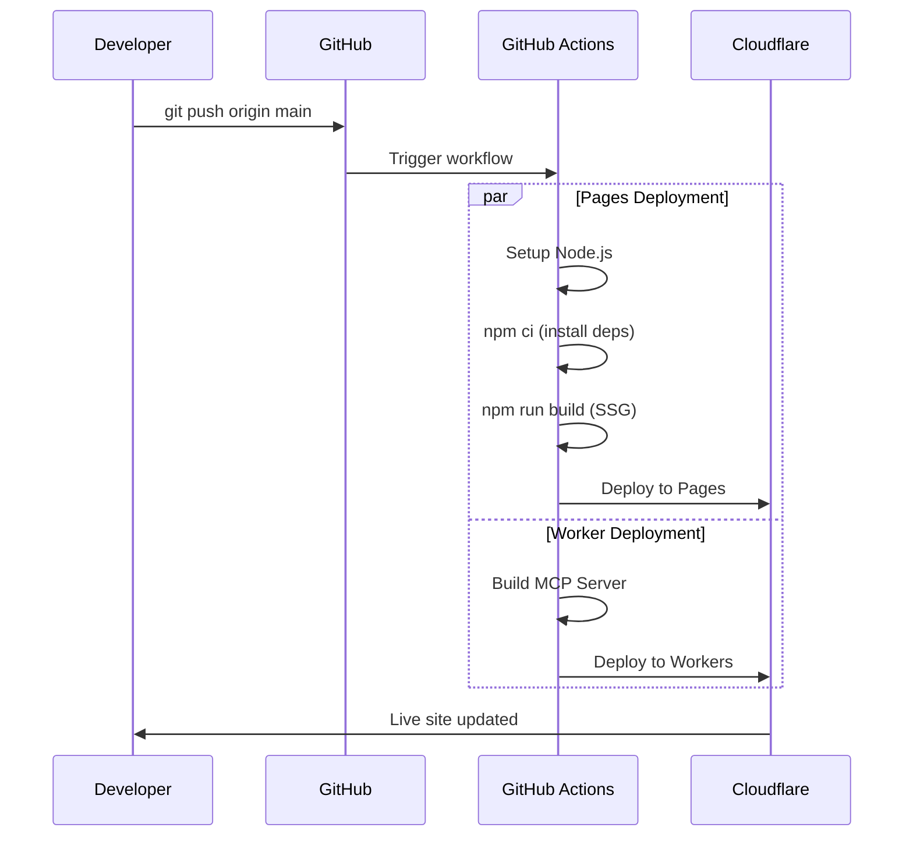

# Penguin Bank Content Management & SSG Architecture

This directory contains the content management system and Static Site Generator (SSG) for the Penguin Bank website. The system automatically transforms structured content into a production-ready website deployed on Cloudflare Pages.

## 🏗️ Architecture Overview

The Penguin Bank project uses a **dual-deployment architecture**:

- **Static Website**: Cloudflare Pages (generated from this content system)
- **MCP Server**: Cloudflare Workers (handles AI assistant integrations)



## 📁 File Structure

```
content/
├── README.md           # This documentation
├── index.md           # Main site content (YAML frontmatter + markdown)
└── [future pages]     # Additional pages as needed

templates/
├── layout.hbs         # Main HTML template
└── partials/
    ├── hero.hbs       # Hero section template
    ├── carousel.hbs   # Carousel component template
    ├── functions.hbs  # Banking functions template
    ├── footer.hbs     # Footer template
    ├── scripts.hbs    # JavaScript functionality
    └── icon.hbs       # SVG icon mapping

build.js               # SSG build script
package.json           # Dependencies and scripts
```

## 🔧 Technology Stack

### Core Libraries
- **[gray-matter](https://github.com/jonschlinkert/gray-matter)** `^4.0.3` - YAML frontmatter parsing
- **[handlebars](https://handlebarsjs.com/)** `^4.7.8` - Template engine
- **[fs-extra](https://github.com/jprichardson/node-fs-extra)** `^11.2.0` - Enhanced filesystem operations

### Development Tools
- **[serve](https://github.com/vercel/serve)** `^14.2.4` - Local development server
- **[nodemon](https://nodemon.io/)** `^3.1.9` - Auto-restart during development

### Build Process
- **Node.js** - Runtime environment
- **GitHub Actions** - CI/CD automation
- **Cloudflare Pages** - Static hosting platform

## 🚀 SSG Build Process

### 1. Content Parsing
The SSG reads `content/index.md` and extracts:
- **YAML Frontmatter**: Structured data (hero, carousels, functions, footer)
- **Markdown Content**: Additional content (currently minimal)

### 2. Template Compilation
Using Handlebars, the system:
- Loads the main `layout.hbs` template
- Registers all partials from `templates/partials/`
- Applies custom helpers for logic operations

### 3. Dynamic Generation
The build script programmatically creates:
- **Hero Section**: Cycling taglines from `hero.taglines[]`
- **Carousel Sections**: Multiple carousels from `carousels.{name}`
- **Function Cards**: Banking features from `functions.categories[]`
- **Footer**: Navigation and copyright from `footer`

### 4. Asset Integration
- Preserves existing CSS (Tailwind)
- Maintains JavaScript functionality
- Keeps all images and icons
- Generates semantic HTML with proper IDs and classes

## 🔄 CI/CD Pipeline Integration

### Deployment Flow



### Change Detection

The CI/CD system intelligently detects changes:

**Pages Triggers** (rebuilds static site):
- `content/**` - Content changes
- `templates/**` - Template modifications  
- `build.js` - Build script updates
- `package.json` - Dependency changes
- `public/**` - Direct asset changes

**Worker Triggers** (rebuilds MCP server):
- `my-mcp-server/**` - MCP server code changes

### GitHub Actions Workflow

Located in `.github/workflows/deploy.yml`:

1. **Change Detection**: Analyzes which components changed
2. **Parallel Deployment**: Pages and Workers deploy simultaneously
3. **Quality Checks**: Linting and type checking for Workers
4. **Smart Caching**: Only rebuilds changed components
5. **Status Reporting**: Clear deployment summaries

## 🛠️ Development Workflow

### Local Development

```bash
# Install dependencies
npm install

# Start development server (builds + serves)
npm run dev

# Build only
npm run build

# Watch for changes (auto-rebuild)
npm run watch
```

### Content Updates

1. **Edit Content**: Modify `content/index.md`
2. **Test Locally**: Run `npm run dev`
3. **Commit Changes**: Standard git workflow
4. **Auto-Deploy**: Push triggers automatic build and deployment

### Template Modifications

1. **Edit Templates**: Modify files in `templates/`
2. **Test Build**: Run `npm run build`
3. **Verify Output**: Check `public/index.html`
4. **Deploy**: Push to trigger CI/CD

## 📊 Content Structure Guide

### YAML Frontmatter Schema

```yaml
---
title: "Page Title"
description: "Meta description"
layout: "home"

hero:
  section_id: "hero"
  tagline_id: "hero-tagline"
  taglines: ["Tagline 1", "Tagline 2", "Tagline 3"]

carousels:
  carousel_name:
    section_id: "section-id"
    section_title: "Display Title"
    track_id: "track-id"
    dots_id: "dots-id"
    background_class: "bg-gray-50" # optional
    slides:
      - title: "Slide Title"
        icon: "icon-name"  # Use either icon OR image
        bullets: ["Point 1", "Point 2", "Point 3"]
      - title: "Slide with Custom Image"
        image: "/images/carousel/my-image.jpg"  # Custom image path
        alt: "Descriptive alt text for accessibility"  # Required for images
        bullets: ["Point 1", "Point 2", "Point 3"]

functions:
  section_id: "functions"
  section_title: "Section Title"
  categories:
    - id: "category-id"
      title: "Category Title"
      functions:
        - name: "function_name"
          status: "coming soon"
          user_input: "Example user query"
          response: "Example AI response"

footer:
  section_id: "footer"
  links:
    - text: "Link Text"
      href: "#anchor"
  copyright: "Copyright text"
---
```

### Visual Assets System

The carousel system supports both **SVG icons** and **custom images**:

#### SVG Icons (Built-in)
Available icons (mapped in `templates/partials/icon.hbs`):
- `shield-check` - Security/protection
- `lock` - Privacy/security
- `credit-card` - Payments/cards
- `chart-line` - Analytics/trends
- `search` - Search/discovery
- `globe` - Web/global
- `cpu` - Technology/processing
- `shield` - Protection/safety
- `message-circle` - Communication
- `settings` - Configuration
- `star` - Rating/quality

#### Custom Images
For custom images in carousels, use the `image` property instead of `icon`:

```yaml
slides:
  - title: "Slide with custom image"
    image: "/images/my-carousel-image.jpg"
    alt: "Descriptive alt text for accessibility"
    bullets: ["Point 1", "Point 2", "Point 3"]
  - title: "Slide with SVG icon"
    icon: "shield-check"
    bullets: ["Point 1", "Point 2", "Point 3"]
```

#### Image Requirements & Best Practices

**📁 File Location:**
- Place all carousel images in: `public/images/carousel/`
- This keeps them organized and separate from favicon/icon files

**📏 Image Specifications:**
- **Dimensions**: 400×320px (1.25:1 aspect ratio) recommended
- **File Size**: Keep under 200KB for optimal loading
- **Formats**: JPG, PNG, WebP, or SVG
- **Resolution**: 2x retina support (800×640px actual size)

**🎨 Visual Guidelines:**
- Use consistent style across all carousel images
- Maintain good contrast for readability
- Consider dark mode compatibility
- Keep visual complexity moderate (images are 264px tall on mobile)

**♿ Accessibility:**
- Always include `alt` text for images
- Use descriptive, meaningful alt text
- Keep alt text under 125 characters
- Don't start with "Image of" or "Picture of"

#### Image File Naming Convention

Use descriptive, kebab-case naming:
```
✅ Good Examples:
- banking-security-shield.jpg
- mobile-payment-process.png
- ai-assistant-chat.webp
- credit-card-management.svg

❌ Avoid:
- IMG_1234.jpg
- image1.png
- photo.jpeg
- untitled.gif
```

#### Adding Images to Carousels

**Step 1: Add Image File**
```bash
# Create carousel images directory
mkdir -p public/images/carousel

# Add your image
cp ~/Downloads/my-image.jpg public/images/carousel/banking-security-shield.jpg
```

**Step 2: Update Content**
```yaml
# In content/index.md
carousels:
  intro:
    slides:
      - title: "Your banking data is secure"
        image: "/images/carousel/banking-security-shield.jpg"
        alt: "Shield with checkmark representing banking security"
        bullets:
          - "End-to-end encryption for all transactions"
          - "Multi-factor authentication required"
          - "Real-time fraud monitoring active"
```

**Step 3: Test Locally**
```bash
npm run dev
# Check that image loads correctly in browser
```

**Step 4: Commit and Deploy**
```bash
git add public/images/carousel/banking-security-shield.jpg
git add content/index.md
git commit -m "feat: add banking security image to intro carousel"
git push origin main
```

#### Image Optimization Tips

**Before Adding Images:**
1. **Compress images** using tools like:
   - [TinyPNG](https://tinypng.com/) for PNG/JPG
   - [Squoosh](https://squoosh.app/) for all formats
   - [ImageOptim](https://imageoptim.com/) (Mac app)

2. **Generate multiple formats** if needed:
   ```bash
   # Convert to WebP for better compression
   cwebp -q 80 image.jpg -o image.webp
   ```

3. **Create retina versions** for sharp display:
   - Standard: 400×320px (`image.jpg`)
   - Retina: 800×640px (`image@2x.jpg`)

#### Fallback System

The template system automatically handles fallbacks:
1. **Image specified**: Shows custom image
2. **Icon specified**: Shows SVG icon  
3. **Neither specified**: Shows default clock icon
4. **Image fails to load**: Browser shows alt text

#### Performance Considerations

**Loading Strategy:**
- Images are loaded immediately (no lazy loading currently)
- Consider image size for mobile users
- WebP format provides ~30% smaller files than JPG

**CDN Benefits:**
- Cloudflare Pages automatically optimizes images
- Global CDN distribution for fast loading
- Automatic compression and format conversion

#### Troubleshooting Images

**Image not showing:**
1. Check file path: `/images/carousel/filename.jpg`
2. Verify file exists in `public/images/carousel/`
3. Check browser console for 404 errors
4. Ensure proper YAML syntax in `content/index.md`

**Image too large/small:**
1. The container is 264px tall on mobile, 320px on desktop
2. Images are automatically scaled to fit
3. Use CSS `object-fit: cover` behavior (maintains aspect ratio)

**Accessibility issues:**
1. Always include `alt` attribute
2. Test with screen readers
3. Ensure sufficient color contrast
4. Don't rely solely on images to convey information

#### SSG Robustness & Error Handling

**✅ The SSG system is designed to handle image updates safely:**

1. **Graceful Fallbacks**: If an image fails to load, the system falls back to:
   - Alt text display (browser default)
   - No broken builds or deployment failures
   - Carousel continues to function normally

2. **Build Process Safety**: 
   - Missing images don't break the SSG build
   - Invalid image paths are preserved (browser handles 404s)
   - Template compilation continues even with missing assets

3. **Deployment Safety**:
   - Images are static assets copied during deployment
   - No dynamic image processing that could fail
   - CDN handles missing images gracefully

4. **Mixed Content Support**:
   - Carousels can mix icons and images freely
   - Each slide can independently use `icon` or `image`
   - No conflicts between different visual asset types

**🔧 Safe Update Process:**
1. Add images to `public/images/carousel/` first
2. Test locally with `npm run dev`
3. Update `content/index.md` with image references
4. Commit both files together
5. CI/CD automatically includes images in deployment

This approach ensures that **image additions/edits will never break the SSG or deployment process**.

## 🤝 Contributing

### Content Contributions

**For content suggestions, corrections, or improvements:**

📝 **Submit PRs to**: `content/index.md`

**What to include in your PR:**
- Clear description of the change
- Reasoning for the improvement
- Test locally with `npm run dev` before submitting

**Content areas you can improve:**
- Hero taglines
- Carousel slide content
- Banking function descriptions
- User interaction examples
- Footer links and information

### Template Contributions

**For design, layout, or functionality improvements:**

🎨 **Submit PRs to**: `templates/` directory

**Areas for contribution:**
- Visual design improvements
- Responsive design enhancements
- Accessibility improvements
- New component templates
- JavaScript functionality

### Build System Contributions

**For SSG improvements or new features:**

⚙️ **Submit PRs to**: `build.js` or `package.json`

**Potential improvements:**
- Additional Handlebars helpers
- Build optimization
- New content types support
- Development tooling enhancements

### Documentation Contributions

**For documentation improvements:**

📚 **Submit PRs to**: This file (`content/README.md`)

### Contribution Guidelines

1. **Fork the repository**
2. **Create a feature branch**: `git checkout -b feature/your-improvement`
3. **Test your changes locally**: `npm run dev`
4. **Commit with clear messages**: Follow conventional commit format
5. **Submit a Pull Request** with:
   - Clear title and description
   - Screenshots for visual changes
   - Testing notes

### Issue Reporting

**Report bugs or request features:**
- Use GitHub Issues
- Include reproduction steps
- Provide browser/environment details
- Tag appropriately (`bug`, `enhancement`, `content`, etc.)

## 📈 Performance & Optimization

### Build Performance
- **Fast builds**: ~2-3 seconds locally
- **Incremental updates**: Only changed components rebuild
- **Parallel CI/CD**: Pages and Workers deploy simultaneously

### Runtime Performance
- **Static HTML**: No client-side rendering overhead
- **Optimized CSS**: Tailwind with purging
- **Minimal JavaScript**: Only essential interactions
- **CDN Distribution**: Cloudflare global network

### SEO Optimization
- **Semantic HTML**: Proper heading hierarchy
- **Meta tags**: Dynamic title and description
- **Structured data**: Ready for schema.org markup
- **Fast loading**: Static assets with CDN

## 🔍 Troubleshooting

### Common Issues

**Build fails locally:**
```bash
# Clean install
rm -rf node_modules package-lock.json
npm install
npm run build
```

**Templates not updating:**
- Check Handlebars syntax
- Verify partial registration in `build.js`
- Clear browser cache

**Content not reflecting:**
- Verify YAML frontmatter syntax
- Check for indentation errors
- Test with `npm run dev`

**CI/CD deployment fails:**
- Check GitHub Actions logs
- Verify all files are committed
- Ensure no syntax errors in templates

### Debug Mode

Enable verbose logging in `build.js`:
```javascript
// Add at top of build.js
process.env.DEBUG = 'true';
```

## 🚀 Future Enhancements

### Planned Features
- [ ] Multi-page support
- [ ] Image optimization pipeline
- [ ] Internationalization (i18n)
- [ ] Content validation
- [ ] Preview deployments for PRs
- [ ] CMS integration options

### Architecture Improvements
- [ ] TypeScript conversion
- [ ] Component testing
- [ ] Performance monitoring
- [ ] Bundle analysis
- [ ] Progressive Web App features

---

## 📞 Support

**Questions about the SSG system?**
- Create a GitHub Issue
- Tag with `question` label
- Provide context about your use case

**Need help contributing?**
- Check existing issues and PRs
- Join discussions in issues
- Follow the contribution guidelines above

---

*This SSG system was designed to be simple, powerful, and maintainable. It demonstrates how modern static site generation can be achieved with minimal dependencies while maintaining professional-grade automation and deployment practices.* 