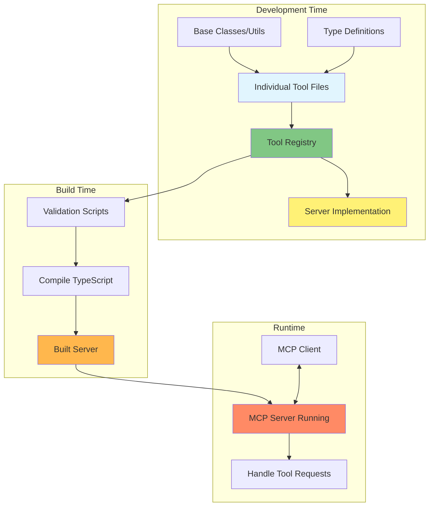
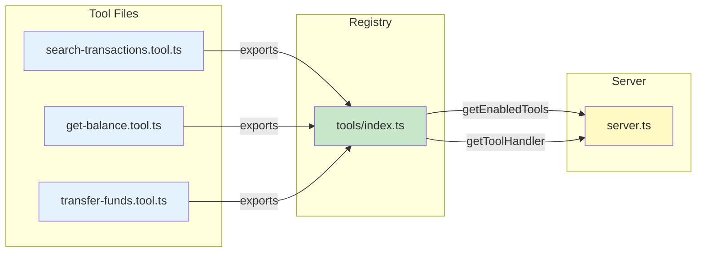
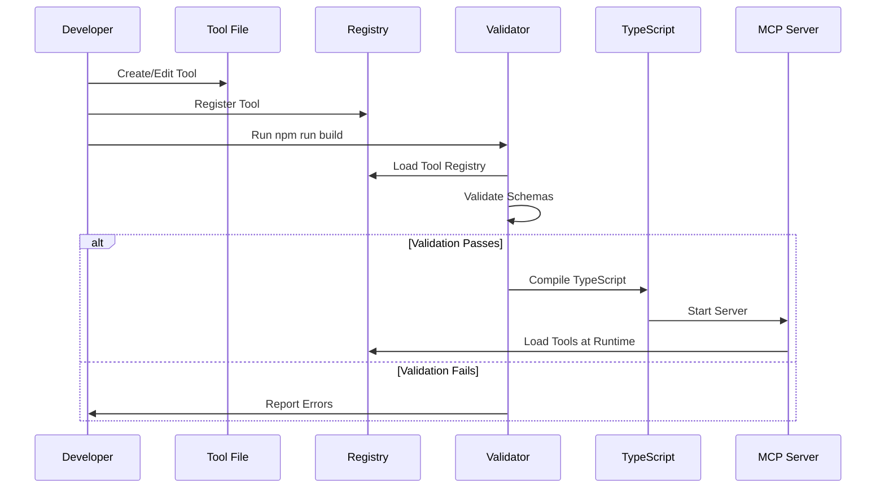
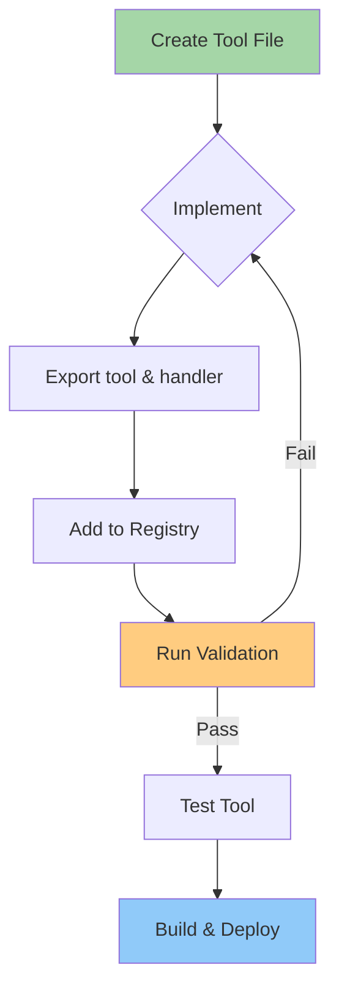
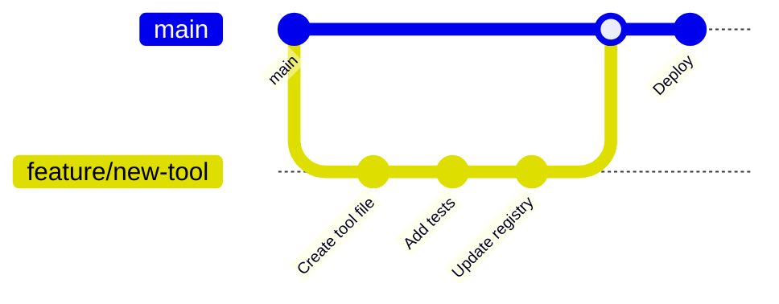

# MCP Banking Demo Server

A modular Model Context Protocol (MCP) server implementation demonstrating best practices for building maintainable, scalable MCP tools using a fictional banking application.

## 🏗️ Architecture Overview

This server uses a modular architecture where each tool is defined in its own file and registered centrally at compile time.



## 📁 Project Structure

```
mcp-banking-demo/
├── src/
│   ├── server.ts                 # Main server entry point
│   ├── types/                    # Shared TypeScript types
│   │   └── index.ts
│   ├── tools/                    # Tool definitions
│   │   ├── index.ts             # Central tool registry
│   │   ├── base.ts              # Base class for tools (optional)
│   │   ├── search-transactions.tool.ts
│   │   ├── get-account-balance.tool.ts
│   │   └── transfer-funds.tool.ts
│   ├── utils/                    # Shared utilities
│   │   ├── supabase.ts
│   │   └── error-handling.ts
│   └── db/                       # Database schemas
│       └── schema.sql
├── scripts/
│   └── validate-tools.ts         # Build-time validation
├── tests/
│   └── tools/                    # Tool-specific tests
├── .env.example
├── package.json
├── tsconfig.json
└── README.md
```

## 🔄 How It Works

### File Relationships



### Build Process



## 🚀 Getting Started

### Prerequisites

- Node.js 18+
- npm or yarn
- Supabase account (for the demo database)

### Installation

1. Clone the repository:
```bash
git clone https://github.com/your-org/mcp-banking-demo.git
cd mcp-banking-demo
```

2. Install dependencies:
```bash
npm install
```

3. Set up environment variables:
```bash
cp .env.example .env
# Edit .env with your Supabase credentials
```

4. Set up the database:
```bash
# Run the schema.sql in your Supabase SQL editor
cat src/db/schema.sql
```

5. Build and start:
```bash
npm run build
npm start
```

## 🛠️ Development

### Adding a New Tool

1. **Create the tool file** in `src/tools/`:

```typescript
// src/tools/my-new-tool.tool.ts
import { Tool } from '@modelcontextprotocol/sdk/types.js';

export const tool: Tool = {
  name: 'my_new_tool',
  description: 'Description for LLMs...',
  inputSchema: {
    type: 'object',
    properties: {
      // Your parameters
    }
  }
};

export async function handler(params: any, context: any) {
  // Implementation
  return {
    content: [{
      type: 'text',
      text: JSON.stringify({ result: 'success' })
    }]
  };
}
```

2. **Register in the tool index**:

```typescript
// src/tools/index.ts
import * as myNewTool from './my-new-tool.tool.js';

export const toolRegistry = {
  // ... existing tools
  my_new_tool: {
    tool: myNewTool.tool,
    handler: myNewTool.handler,
    enabled: true
  }
};
```

3. **Validate and build**:
```bash
npm run validate-tools
npm run build
```

### Tool Development Workflow



## 📋 Available Tools

### search_transactions
Search and filter bank transactions with natural language queries.

**Example Usage:**
```typescript
{
  "categories": ["grocery", "dining"],
  "minAmount": 50,
  "daysBack": 30
}
```

### get_account_balance
Retrieve current balance for one or more accounts.

**Example Usage:**
```typescript
{
  "accountIds": ["CHK-001", "SAV-001"]
}
```

### transfer_funds (Disabled in Demo)
Transfer funds between accounts.

## 🧪 Testing

### Unit Tests
```bash
# Test individual tools
npm test src/tools/search-transactions.tool.test.ts

# Test all tools
npm test
```

### Integration Tests
```bash
# Test with a real MCP client
npm run test:integration
```

### Validation Only
```bash
# Just validate tool schemas
npm run validate-tools
```

## 🔒 Security Considerations

- Tools validate all input parameters
- Supabase RLS (Row Level Security) should be enabled
- API keys should never be exposed to clients
- Each tool can define required permissions

## 📊 Performance

The modular architecture provides several performance benefits:

1. **Lazy Loading**: Tools are only loaded when needed
2. **Parallel Processing**: Multiple tools can run concurrently
3. **Caching**: Tool definitions are cached after first load
4. **Optimized Queries**: Each tool can optimize its database queries

## 🤝 Contributing

1. Fork the repository
2. Create a feature branch
3. Add your tool following the patterns above
4. Ensure all validations pass
5. Submit a pull request

### Contribution Workflow



## 📚 Documentation

### For Developers
- Each tool file includes inline documentation
- TypeScript types provide IDE support
- Validation errors guide correct implementation

### For AI Agents
- Tool descriptions explain natural language mapping
- Input schemas include detailed parameter descriptions
- Error messages include actionable suggestions

## 🚨 Troubleshooting

### Common Issues

1. **Tool not appearing in list**
   - Check it's registered in `tools/index.ts`
   - Ensure `enabled: true`
   - Run build to compile changes

2. **Schema validation failing**
   - Check JSON Schema syntax
   - Ensure all enums are valid
   - Property names must match exactly

3. **Runtime errors**
   - Check Supabase connection
   - Verify API keys in `.env`
   - Check tool handler has proper error handling

## 📄 License

MIT License - See LICENSE file for details

## 🙏 Acknowledgments

- Built with [Model Context Protocol SDK](https://github.com/modelcontextprotocol/sdk)
- Database powered by [Supabase](https://supabase.com)
- Inspired by MCP best practices and community patterns