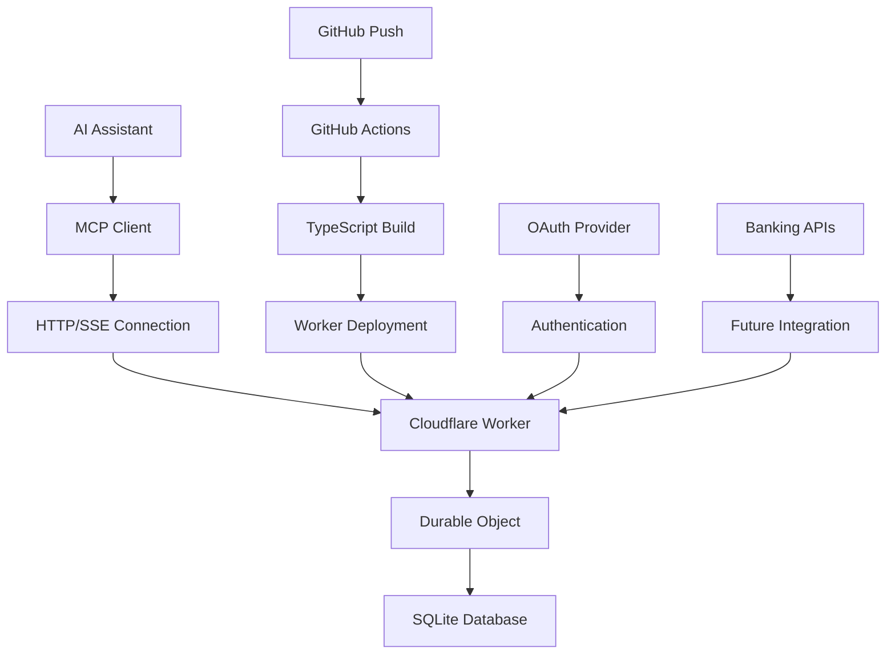
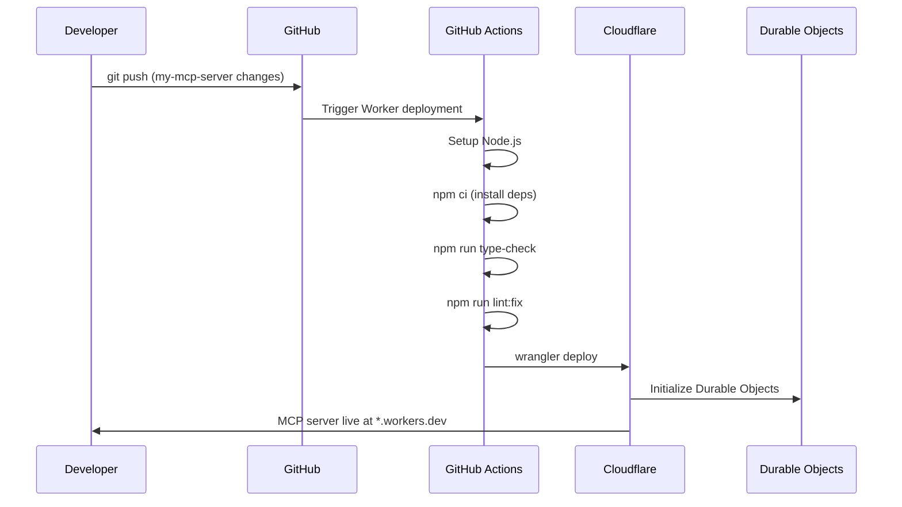

# Penguin Bank MCP Server

A production-ready Model Context Protocol (MCP) server implementation for AI-powered banking, deployed on Cloudflare Workers with Durable Objects for persistent state management.

## 🏗️ Architecture Overview

The Penguin Bank MCP Server is part of a **dual-deployment architecture**:

- **MCP Server**: Cloudflare Workers (this directory) - Handles AI assistant integrations
- **Static Website**: Cloudflare Pages - User-facing documentation and demos



## 📁 Project Structure

```
my-mcp-server/
├── README.md              # This documentation
├── package.json           # Dependencies and scripts
├── package-lock.json      # Dependency lock file
├── tsconfig.json          # TypeScript configuration
├── wrangler.jsonc         # Cloudflare Worker configuration
├── biome.json            # Code formatting and linting
├── worker-configuration.d.ts  # TypeScript definitions
└── src/
    └── index.ts           # Main MCP server implementation
```

## 🔧 Technology Stack

### Core Framework
- **[Cloudflare Workers](https://workers.cloudflare.com/)** - Serverless execution environment
- **[Durable Objects](https://developers.cloudflare.com/durable-objects/)** - Stateful, consistent storage
- **[TypeScript](https://www.typescriptlang.org/)** `^5.8.3` - Type-safe development

### MCP Implementation
- **[@modelcontextprotocol/sdk](https://github.com/modelcontextprotocol/typescript-sdk)** `^1.12.3` - Official MCP SDK
- **[agents](https://www.npmjs.com/package/agents)** `^0.0.95` - AI agent utilities
- **[zod](https://zod.dev/)** `^3.25.67` - Runtime type validation

### Development Tools
- **[@biomejs/biome](https://biomejs.dev/)** `^2.0.0` - Fast formatter and linter
- **[wrangler](https://developers.cloudflare.com/workers/wrangler/)** `^4.20.5` - Cloudflare development CLI

### Runtime Features
- **SQLite Database** - Persistent storage via Durable Objects
- **Server-Sent Events (SSE)** - Real-time communication
- **OAuth Integration** - Secure authentication (KV namespace)
- **Edge Computing** - Global distribution via Cloudflare

## 🚀 MCP Server Implementation

### Core Features

#### 1. **Banking Functions**
The server implements comprehensive banking operations:

```typescript
// Account Information
- get_balance()           // Current account balance
- get_credit_limit()      // Available credit limit
- get_account_details()   // Full account information

// Transaction Management  
- get_recent_transactions()  // Recent transaction history
- search_transactions()      // Search with natural language
- get_pending_charges()      // Pending/processing transactions

// Payment Operations
- make_payment()            // Process payments
- schedule_payment()        // Set up future payments
- get_payment_due_date()    // Payment due information

// Card Management
- freeze_card()            // Temporarily freeze card
- report_lost_card()       // Report lost/stolen card
- update_pin()             // Change card PIN

// Support & Disputes
- dispute_transaction()    // File transaction disputes
- get_statement()          // Download statements
```

#### 2. **Durable Object Storage**
Persistent state management using Cloudflare's Durable Objects:

```typescript
class MyMCP extends DurableObject {
  private sql: SqlStorage;
  
  // Initialize SQLite database
  async initializeDatabase() {
    await this.sql.exec(`
      CREATE TABLE IF NOT EXISTS transactions (
        id TEXT PRIMARY KEY,
        amount REAL,
        merchant TEXT,
        date TEXT,
        category TEXT
      )
    `);
  }
}
```

#### 3. **MCP Protocol Compliance**
Full implementation of the Model Context Protocol:

- **Tool Registration**: Dynamic banking function discovery
- **Schema Validation**: Zod-based input/output validation  
- **Error Handling**: Proper MCP error responses
- **Streaming Support**: Server-Sent Events for real-time updates

### Authentication & Security

#### OAuth Integration
```typescript
// KV namespace binding for OAuth tokens
interface Env {
  OAUTH_KV: KVNamespace;
  MCP_OBJECT: DurableObjectNamespace<MyMCP>;
}

// Secure token storage and validation
async function validateToken(token: string): Promise<boolean> {
  const stored = await env.OAUTH_KV.get(`token:${token}`);
  return stored !== null;
}
```

#### Security Features
- **Token-based authentication** via KV storage
- **Request validation** with Zod schemas
- **Rate limiting** (configurable)
- **CORS handling** for cross-origin requests
- **Input sanitization** for all banking operations

## 🔄 CI/CD Pipeline Integration

### Deployment Flow



### Change Detection

The CI/CD system deploys the MCP server when:

**Worker Triggers**:
- `my-mcp-server/**` - Any code changes
- `my-mcp-server/package.json` - Dependency updates
- `my-mcp-server/wrangler.jsonc` - Configuration changes
- `my-mcp-server/tsconfig.json` - TypeScript config
- `.github/workflows/deploy.yml` - CI/CD changes

### Quality Checks

Before deployment, the pipeline runs:
1. **Type Checking**: `npm run type-check`
2. **Linting**: `npm run lint:fix` 
3. **Build Validation**: TypeScript compilation
4. **Dependency Audit**: Security vulnerability checks

## 🛠️ Development Workflow

### Local Development

```bash
# Navigate to MCP server directory
cd my-mcp-server

# Install dependencies
npm install

# Start local development server
npm run dev
# or
wrangler dev

# Type checking
npm run type-check

# Linting and formatting
npm run lint:fix
npm run format

# Deploy to production
npm run deploy
```

### Testing the MCP Server

#### 1. **Cloudflare AI Playground**
Test directly in browser:
```
https://playground.ai.cloudflare.com/
Enter URL: https://my-mcp-server.<your-account>.workers.dev/sse
```

#### 2. **Claude Desktop Integration**
Add to Claude Desktop config:
```json
{
  "mcpServers": {
    "penguin-bank": {
      "command": "npx",
      "args": [
        "mcp-remote", 
        "https://my-mcp-server.<your-account>.workers.dev"
      ]
    }
  }
}
```

#### 3. **Local Testing**
```bash
# Test with curl
curl -X POST https://my-mcp-server.<account>.workers.dev/mcp \
  -H "Content-Type: application/json" \
  -d '{"method": "tools/list"}'
```

### Environment Configuration

#### Wrangler Configuration (`wrangler.jsonc`)
```json
{
  "name": "my-mcp-server",
  "main": "src/index.ts", 
  "compatibility_date": "2025-03-10",
  "compatibility_flags": ["nodejs_compat"],
  
  "durable_objects": {
    "bindings": [
      {
        "class_name": "MyMCP",
        "name": "MCP_OBJECT"
      }
    ]
  },
  
  "migrations": [
    {
      "new_sqlite_classes": ["MyMCP"],
      "tag": "v1"
    }
  ]
}
```

#### Environment Variables
```bash
# Set secrets via wrangler
wrangler secret put BANKING_API_KEY
wrangler secret put OAUTH_CLIENT_SECRET

# Set public variables
wrangler secret put ENVIRONMENT --env production
```

## 📊 MCP Protocol Implementation

### Tool Definition Schema

```typescript
interface BankingTool {
  name: string;
  description: string;
  inputSchema: {
    type: "object";
    properties: Record<string, any>;
    required?: string[];
  };
}

// Example: Balance inquiry tool
const getBalanceTool: BankingTool = {
  name: "get_balance",
  description: "Get current account balance and available credit",
  inputSchema: {
    type: "object", 
    properties: {
      account_id: {
        type: "string",
        description: "Account identifier (optional)"
      }
    }
  }
};
```

### Request/Response Flow

```typescript
// MCP Request Handler
export default {
  async fetch(request: Request, env: Env): Promise<Response> {
    // Parse MCP request
    const mcpRequest = await request.json();
    
    // Route to appropriate handler
    switch (mcpRequest.method) {
      case "tools/list":
        return listTools();
      case "tools/call":
        return callTool(mcpRequest.params);
      default:
        return mcpError("Method not found");
    }
  }
};
```

### Error Handling

```typescript
interface MCPError {
  code: number;
  message: string;
  data?: any;
}

// Standard MCP error responses
const MCPErrors = {
  INVALID_REQUEST: { code: -32600, message: "Invalid Request" },
  METHOD_NOT_FOUND: { code: -32601, message: "Method not found" },
  INVALID_PARAMS: { code: -32602, message: "Invalid params" },
  INTERNAL_ERROR: { code: -32603, message: "Internal error" }
};
```

## 🤝 Contributing

### MCP Server Contributions

**For MCP server improvements:**

⚙️ **Submit PRs to**: `my-mcp-server/src/index.ts`

**Areas for contribution:**
- New banking functions
- Enhanced error handling
- Performance optimizations
- Security improvements
- Database schema updates

### Configuration Contributions

**For deployment and configuration:**

🔧 **Submit PRs to**: 
- `my-mcp-server/wrangler.jsonc` - Worker configuration
- `my-mcp-server/package.json` - Dependencies
- `my-mcp-server/tsconfig.json` - TypeScript settings

### Development Tool Contributions

**For development experience improvements:**

🛠️ **Submit PRs to**:
- `my-mcp-server/biome.json` - Linting/formatting rules
- `.github/workflows/deploy.yml` - CI/CD improvements

### Contribution Guidelines

1. **Fork the repository**
2. **Create a feature branch**: `git checkout -b feature/mcp-improvement`
3. **Test locally**: `npm run dev` and test with MCP client
4. **Type check**: `npm run type-check`
5. **Lint code**: `npm run lint:fix`
6. **Submit Pull Request** with:
   - Clear description of MCP functionality
   - Testing instructions
   - Performance impact notes

### Testing Requirements

**Before submitting PRs:**
- [ ] Local development server runs without errors
- [ ] TypeScript compiles successfully
- [ ] All linting rules pass
- [ ] MCP tools respond correctly in playground
- [ ] Durable Object migrations work (if applicable)

## 📈 Performance & Optimization

### Worker Performance
- **Cold start**: ~50-100ms (optimized with Durable Objects)
- **Warm requests**: ~5-20ms response time
- **Global distribution**: 300+ Cloudflare edge locations
- **Automatic scaling**: Handles traffic spikes seamlessly

### Database Performance
- **SQLite on Durable Objects**: Consistent, ACID transactions
- **Regional persistence**: Data stored in optimal regions
- **Query optimization**: Indexed lookups for transactions
- **Connection pooling**: Automatic resource management

### Memory Usage
- **Runtime footprint**: ~10-50MB per instance
- **Database size**: Scales with transaction history
- **Request payload**: Optimized JSON responses
- **Streaming**: SSE for large data sets

## 🔍 Troubleshooting

### Common Issues

**Worker deployment fails:**
```bash
# Check wrangler authentication
wrangler whoami

# Re-authenticate if needed
wrangler login

# Check configuration
wrangler dev --local
```

**Durable Object errors:**
```bash
# Check migrations in wrangler.jsonc
# Ensure class_name matches export
# Verify SQLite schema syntax
```

**MCP client connection issues:**
```bash
# Test direct endpoint
curl https://my-mcp-server.<account>.workers.dev/sse

# Check CORS configuration
# Verify authentication tokens
```

**TypeScript compilation errors:**
```bash
# Clean install
rm -rf node_modules package-lock.json
npm install

# Check TypeScript version compatibility
npm run type-check
```

### Debug Mode

Enable verbose logging:
```typescript
// Add to src/index.ts
const DEBUG = true;

if (DEBUG) {
  console.log('MCP Request:', request);
  console.log('Durable Object State:', state);
}
```

### Monitoring

**Cloudflare Dashboard:**
- **Analytics**: Request volume, error rates, latency
- **Logs**: Real-time worker logs and errors
- **Metrics**: CPU usage, memory consumption
- **Alerts**: Configure notifications for issues

## 🚀 Future Enhancements

### Planned Features
- [ ] **Real Banking Integration**: Connect to actual banking APIs
- [ ] **Multi-user Support**: User isolation and data privacy
- [ ] **Advanced Analytics**: Spending insights and budgeting
- [ ] **Webhook Support**: Real-time transaction notifications
- [ ] **Mobile Optimization**: Enhanced mobile MCP clients
- [ ] **Audit Logging**: Comprehensive action tracking

### Technical Improvements
- [ ] **Caching Layer**: Redis integration for performance
- [ ] **Rate Limiting**: Advanced request throttling
- [ ] **Monitoring**: OpenTelemetry observability
- [ ] **Testing**: Comprehensive unit and integration tests
- [ ] **Documentation**: OpenAPI/Swagger specifications

### Integration Opportunities
- [ ] **Multiple Banks**: Multi-bank account aggregation
- [ ] **Investment Accounts**: Portfolio management tools
- [ ] **Credit Monitoring**: Credit score tracking
- [ ] **Bill Management**: Automated bill pay integration
- [ ] **Budgeting Tools**: AI-powered financial planning

## 📞 Support

### MCP Server Issues
- **GitHub Issues**: Tag with `mcp-server` label
- **Worker Logs**: Check Cloudflare dashboard
- **Discord**: Join MCP community discussions

### Development Help
- **Cloudflare Docs**: [workers.cloudflare.com](https://workers.cloudflare.com)
- **MCP Specification**: [modelcontextprotocol.io](https://modelcontextprotocol.io)
- **TypeScript Guide**: [typescriptlang.org](https://typescriptlang.org)

### Production Support
- **Cloudflare Support**: Enterprise support available
- **Status Page**: [cloudflarestatus.com](https://cloudflarestatus.com)
- **Community**: [community.cloudflare.com](https://community.cloudflare.com)

---

## 🌟 Key Benefits

**For AI Assistants:**
- ✅ **Standardized Protocol**: Works with any MCP-compatible client
- ✅ **Real-time Responses**: Fast, streaming-capable banking operations
- ✅ **Global Availability**: Deployed across 300+ edge locations
- ✅ **Secure by Design**: OAuth, encryption, and input validation

**For Developers:**
- ✅ **Modern Stack**: TypeScript, Durable Objects, edge computing
- ✅ **Production Ready**: CI/CD, monitoring, error handling
- ✅ **Scalable Architecture**: Handles growth automatically
- ✅ **Developer Experience**: Hot reloading, type safety, linting

**For Users:**
- ✅ **Natural Language**: Banking through conversational AI
- ✅ **Always Available**: 99.99% uptime with global distribution
- ✅ **Privacy Focused**: Data isolation and secure authentication
- ✅ **Future Proof**: Built on emerging MCP standard

---

*This MCP server demonstrates how modern serverless architecture can power the next generation of AI-integrated financial services, providing a foundation for conversational banking experiences.*
